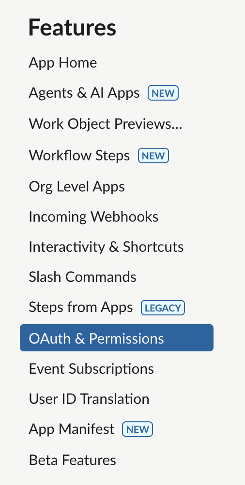
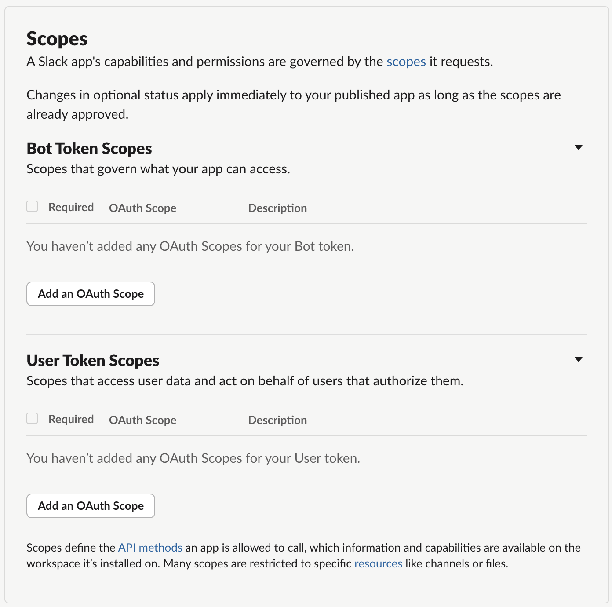
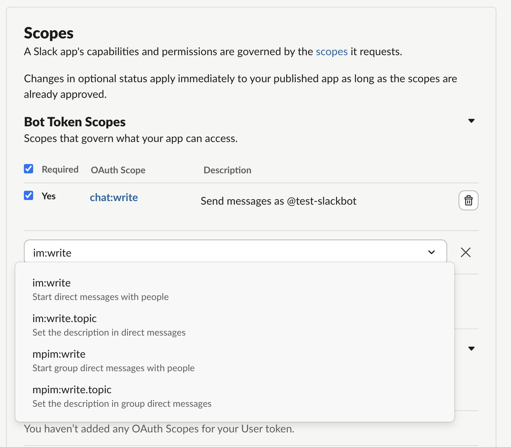
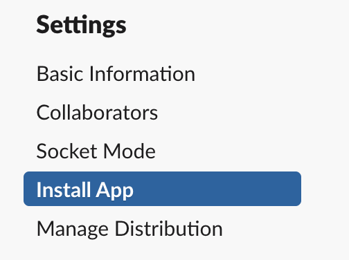
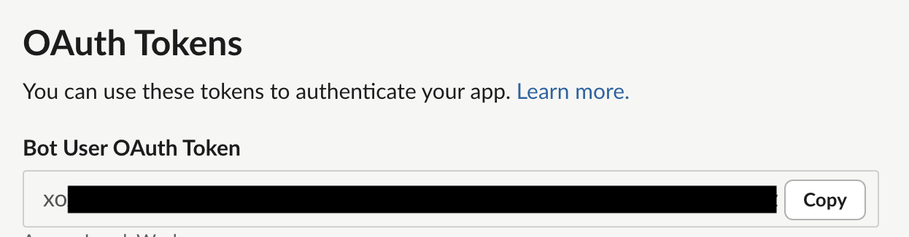
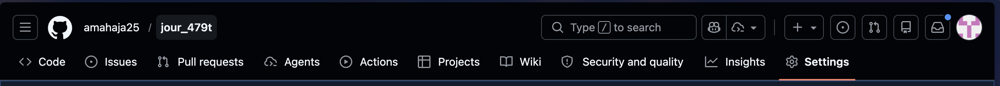
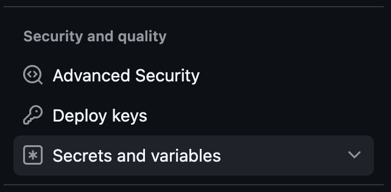
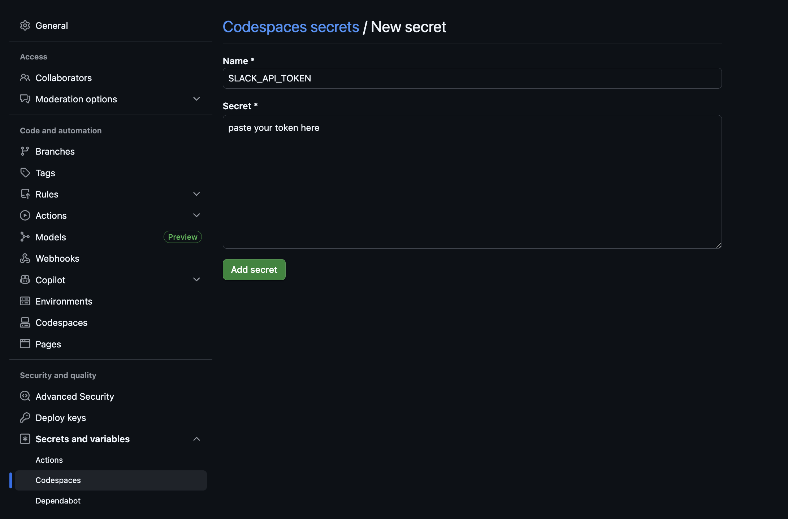

## Instructions for setting up and testing your first custom Slackbot/Slack App
1. First open your codespace. Make sure you've pushed any changes that might be stragglers. Then, run ``` git pull ``` in your terminal to pull the new files I pushed to the main branch of my repository for this class.
1. Go to [https://api.slack.com/apps?new_app=1](https://api.slack.com/apps?new_app=1) and create a new Slack app. We’ll be creating our app from **scratch**, so choose that option.
    1. Give your app a name!
    2. Select NewsAppsUMD as the workspace you develop your app in. Send me the name of your app so that Derek can add it to the workspace!
2. Go to **OAuth & Permissions** on the sidebar. Look at the heading that says **Scopes, then look at Bot Token Scopes**. Click **Add an OAuth Scope**.



    1. For now, we can enable these two, but I encourage you to look at the other options to see what you can make your custom Slackbot do!!!!
* Add the [`chat:write` scope](https://api.slack.com/scopes/chat:write) to grant your app the permission to post messages in channels it's a member of.
* Add the [`im:write` scope](https://api.slack.com/scopes/im:write) to grant your app the permission to post messages in DMs.



3. Install the app in your workspace by clicking **Install App** in the top left of the navigation bar under the **Settings** header.


4. Copy your bot token, which should be under the heading **OAuth Tokens** in the sidebar. This will be available after you install your app in the NewsAppsUMD workspace.

5. Go to your branch of the GitHub repo. Click Settings at the top. Then on the left, click **Secrets and variables** dropdown, then click codespaces. Click the green button to add a new repository secret. save it under the name SLACK_API_TOKEN.







6. If your codespace is already open, you’ll need to reload it for the change to take effect. Otherwise, we're basically done! Yay!
7. Now, to test out your bot, make sure to run the following in your terminal:

    1) ```python3 -m venv venv ``` 
    
        ^ This creates our virtual environment so we can install packages

    2) ``` source venv/bin/activate``` 
    
        ^This activates our virtual environment (venv), essentially turning it on and placing us in that environment.

    3) ``` pip install -r requirements.txt ``` 

        ^This installs the packages we need that are helpfully listed out in the ```requirements.txt``` file in your repo

    4) ```python3 week10/slackbot.py``` 
    
        ^This triggers the slackbot to begin!!!

    5) Look at the output in your terminal. If it says "success!" then head over to the #jour479t channel! If it prints an error, let's figure that out together.

##### <i>Credit goes to Derek Willis for an older version of the base Slackbot script!</i>


